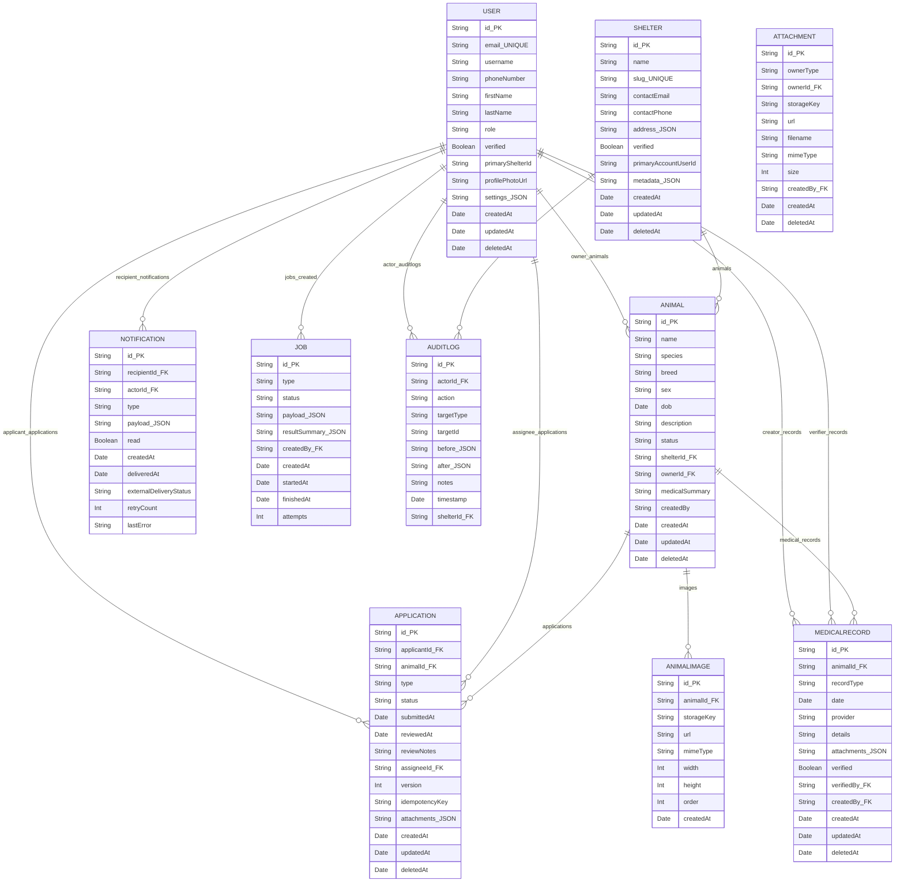

%% ERD generated from schema.prisma
%% Do not edit this file directly — regenerate from schema.prisma if needed

# Entity-Relationship Diagram (generated)

The Mermaid ER diagram below was generated from `schema.prisma`. It shows models, primary keys (PK), foreign keys (FK) where obvious, and basic types. Enums are listed after the diagram.

## Enums

- Role: GENERAL_MEMBER, SHELTER_MEMBER, ADMIN
- Species: CAT, DOG
- Sex: MALE, FEMALE, UNKNOWN
- AnimalStatus: DRAFT, SUBMITTED, PUBLISHED, RETIRED
- ApplicationType: ADOPTION, REHOME
- ApplicationStatus: PENDING, UNDER_REVIEW, APPROVED, REJECTED, WITHDRAWN
- MedicalRecordType: TREATMENT, CHECKUP, VACCINE, SURGERY, OTHER
- ExternalDeliveryStatus: NOT_APPLICABLE, PENDING, SENT, FAILED
- JobStatus: PENDING, RUNNING, SUCCEEDED, FAILED

## Notes

- Fields marked `PK` are primary keys. Fields with `FK` are foreign-key columns in the Prisma schema (referencing the named model).
- `Attachment` in the Prisma schema is implemented as a polymorphic generic owner (ownerType/ownerId) and therefore is shown as a standalone entity.
- This file was generated to provide a simple Mermaid erDiagram view. For PlantUML / Chen notation or alternative styling, generate separate files.
