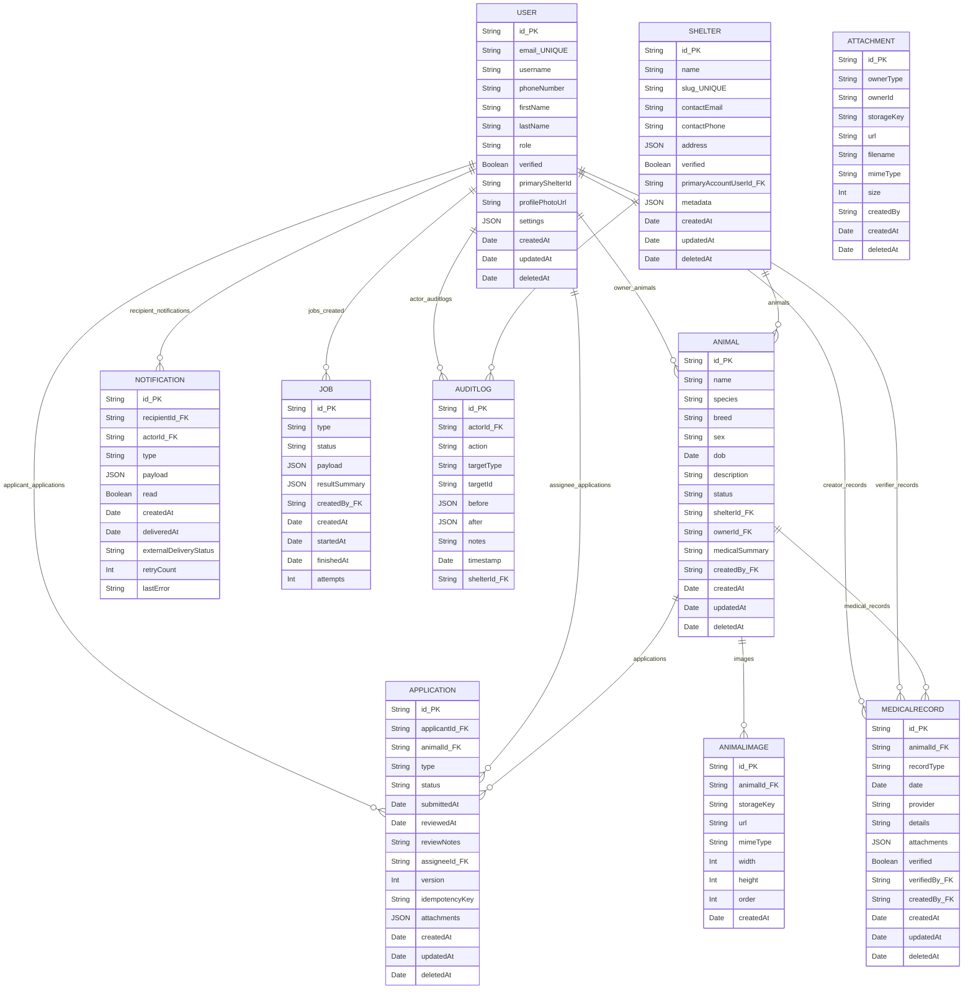

%% ERD generated from schema.prisma
%% Do not edit this file directly — regenerate from schema.prisma if needed

# Entity-Relationship Diagram (generated)

The Mermaid ER diagram below was generated from `schema.prisma`. It shows models, primary keys (PK), foreign keys (FK) where obvious, and basic types. Enums are listed after the diagram.

## Enums

- Role: GENERAL_MEMBER, SHELTER_MEMBER, ADMIN
- Species: CAT, DOG
- Sex: MALE, FEMALE, UNKNOWN
- AnimalStatus: DRAFT, SUBMITTED, PUBLISHED, RETIRED
- ApplicationType: ADOPTION, REHOME
- ApplicationStatus: PENDING, UNDER_REVIEW, APPROVED, REJECTED, WITHDRAWN
- MedicalRecordType: TREATMENT, CHECKUP, VACCINE, SURGERY, OTHER
- ExternalDeliveryStatus: NOT_APPLICABLE, PENDING, SENT, FAILED
- JobStatus: PENDING, RUNNING, SUCCEEDED, FAILED

## Notes

- Fields marked `PK` are primary keys. Fields with `FK` are foreign-key columns in the Prisma schema (referencing the named model).
- `Attachment` in the Prisma schema is implemented as a polymorphic generic owner (ownerType/ownerId) and therefore is shown as a standalone entity.
- This file was generated to provide a simple Mermaid erDiagram view. For PlantUML / Chen notation or alternative styling, generate separate files.

## Cardinalities（簡要）

- USER 1 --- N APPLICATION  (作為 applicant)
- USER 1 --- N APPLICATION  (作為 assignee)
- USER 1 --- N ANIMAL       (owner, `ownerId` optional)
- SHELTER 1 --- N ANIMAL     (`shelterId` optional)
- ANIMAL 1 --- N ANIMALIMAGE (每隻動物有多張圖片, `animalId` required)
- ANIMAL 1 --- N MEDICALRECORD
- ANIMAL 1 --- N APPLICATION
- MEDICALRECORD N --- 1 USER (verifiedBy 可為空)
- NOTIFICATION N --- 1 USER (recipientId required；actorId optional)
- JOB N --- 1 USER (createdBy optional)
- AUDITLOG N --- 1 USER (actorId optional)
- ATTACHMENT 多為 polymorphic owner：`ownerType` + `ownerId` 指向任意資源（非 DB FK）；在此使用 N 表示多

## 實體摘要（重要欄位）

- USER
  - 重要欄位：`id`, `email` (unique), `role`, `primaryShelterId`, `profilePhotoUrl`, `settings`, `createdAt`
  - 備註：可作為 application 的 applicant/assignee、animal owner、medical record 的 creator/verifier

- SHELTER
  - 重要欄位：`id`, `name`, `slug` (unique), `primaryAccountUserId`, `address`, `verified`
  - 備註：管理動物與 audit logs

- ANIMAL
  - 重要欄位：`id`, `name`, `species`, `sex`, `status`, `shelterId` (opt), `ownerId` (opt), `createdBy`、`medicalSummary`
  - 備註：關聯 `AnimalImage[]`, `MedicalRecord[]`, `Application[]`

- ANIMALIMAGE
  - 重要欄位：`id`, `animalId`, `storageKey`, `url`, `mimeType`, `width`, `height`, `order`, `createdAt`
  - 備註：專屬於 Animal（有明確 FK 與 relation）

- APPLICATION
  - 重要欄位：`id`, `applicantId`, `animalId`, `type`, `status`, `submittedAt`, `assigneeId` (opt), `attachments` (Json)
  - 備註：attachments 為 JSON（存放檔案 metadata 或 reference）；同時有 indexes 於 applicantId+status, animalId

- MEDICALRECORD
  - 重要欄位：`id`, `animalId`, `recordType`, `date`, `attachments` (Json), `verified` (Boolean), `verifiedBy` (opt), `createdBy`
  - 備註：有 verified 與 verifier relation

- ATTACHMENT
  - 重要欄位：`id`, `ownerType`, `ownerId`, `storageKey`, `url`, `filename`, `mimeType`, `size`, `createdBy`, `createdAt`
  - 備註：polymorphic 設計，`ownerType` + `ownerId` 在應用層解讀，不為 DB FK

- NOTIFICATION
  - 重要欄位：`id`, `recipientId`, `actorId` (opt), `type`, `payload` (Json), `read`, `createdAt`
  - 備註：recipientId 為主要索引欄位

- JOB
  - 重要欄位：`id`, `type`, `status`, `payload` (Json), `resultSummary` (Json), `createdBy` (opt), `attempts`
  - 備註：後台工作紀錄，createdBy 為可選欄位

- AUDITLOG
  - 重要欄位：`id`, `actorId` (opt), `action`, `targetType`, `targetId`, `before` (Json), `after` (Json), `timestamp`, `shelterId` (opt)
  - 備註：操作稽核紀錄，常與 shelter 或 user 有關

---

