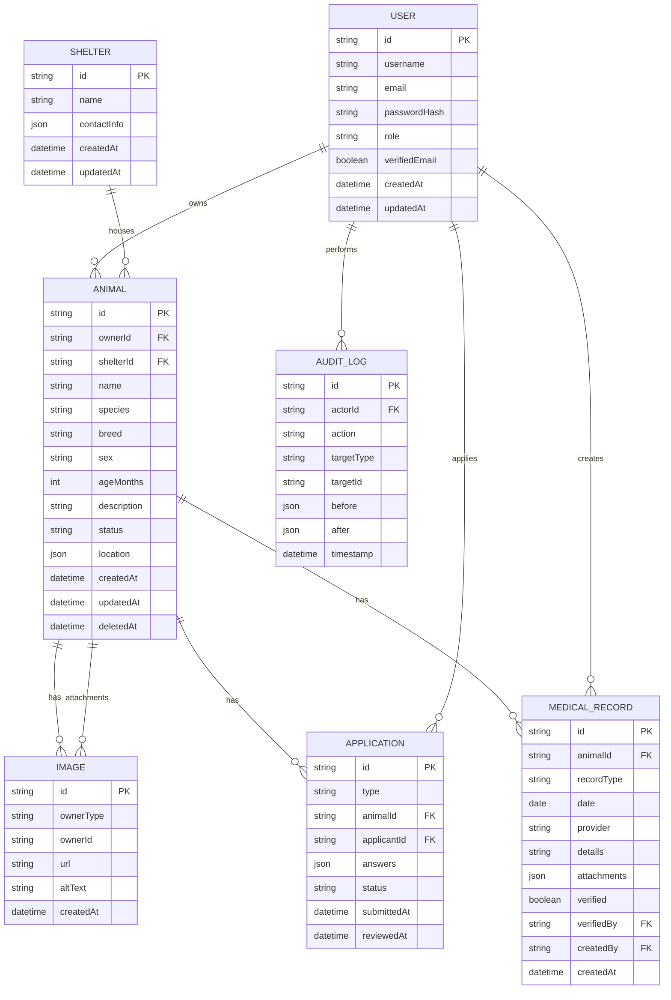
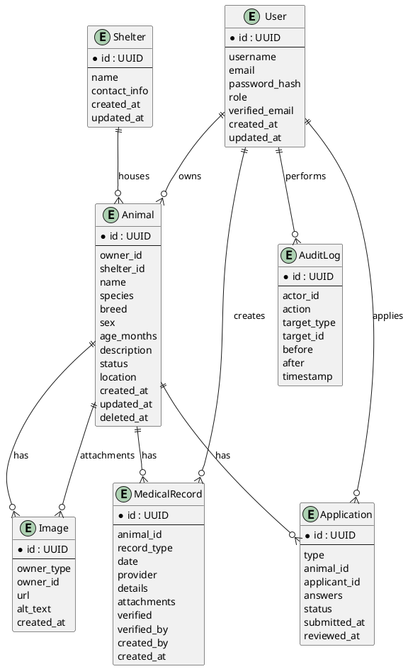

# ERD（Entity Relationship Diagram）— 貓狗領養平台

此檔案提供：
- 主要資料表（實體）與欄位摘要
- 關聯（FK）與基數（cardinality）說明
- Mermaid 與 PlantUML 原始碼（可在支援的渲染器中預覽）

注意：此 ERD 以 MVP 為導向，側重於：User、Animal、Application、MedicalRecord、Image 與 AuditLog。請視需求延伸索引、分區或監控表（如 Notification、Jobs）。

---

## 實體摘要（重要欄位）
- User (id PK, username, email, passwordHash, role, verifiedEmail, createdAt, updatedAt)
- Shelter (id PK, name, contactInfo, createdAt, updatedAt)
- Animal (id PK, ownerId FK -> User.id, shelterId FK -> Shelter.id, name, species, breed, sex, ageMonths, description, status, location, createdAt, updatedAt, deletedAt)
- Image (id PK, ownerType, ownerId, url, altText, createdAt)
- Application (id PK, type, animalId FK -> Animal.id, applicantId FK -> User.id, answers JSON, status, submittedAt, reviewedAt)
- MedicalRecord (id PK, animalId FK -> Animal.id, recordType, date, provider, details, attachments JSON, verified, verifiedBy FK -> User.id, createdBy FK -> User.id)
- AuditLog (id PK, actorId FK -> User.id, action, targetType, targetId, before JSON, after JSON, timestamp)
- Conversation / Message (conversationId PK, participants[], Message: id PK, conversationId FK, senderId FK -> User.id, content, createdAt)

---

## Cardinalities（簡要）
- User 1 --- N Animal (as owner)
- Shelter 1 --- N Animal
- Animal 1 --- N Image
- Animal 1 --- N Application
- User 1 --- N Application (as applicant)
- Animal 1 --- N MedicalRecord
- User 1 --- N MedicalRecord (createdBy or verifiedBy)
- Any entity (Animal/Application/MedicalRecord) 可有多個 Image 附件（Image.ownerType + ownerId）

---

## Mermaid ER Diagram（erDiagram）

---

## PlantUML ER Diagram（可用 PlantUML 或 IDE 外掛渲染）

---

## 建議與下一步
- 若需要，我可以：
  - 將上述 PlantUML/Mermaid 轉成 SVG/PNG 並放到 `specs/002-title-description-project/assets/`。
  - 直接根據 ERD 產生完整 `schema.prisma`（包含索引與 foreign key 約束）。
  - 產生 SQL migration 模板（Postgres）與初始 migration 指令。

告訴我你想要哪一個，我會接著把圖檔或 migration 加到分支 `002-title-description-project`。