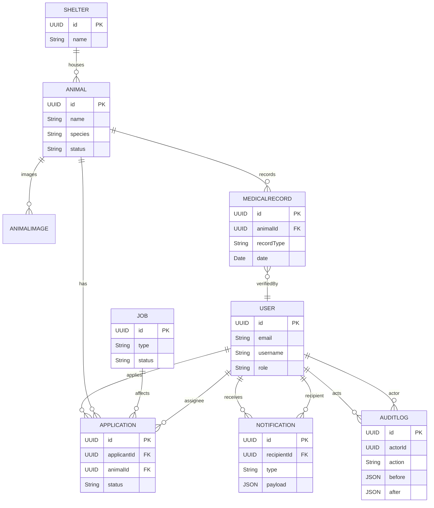
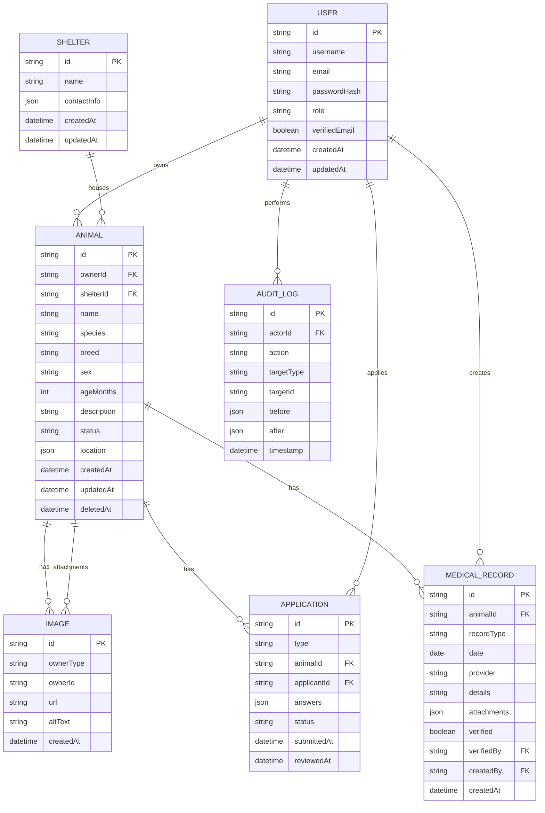
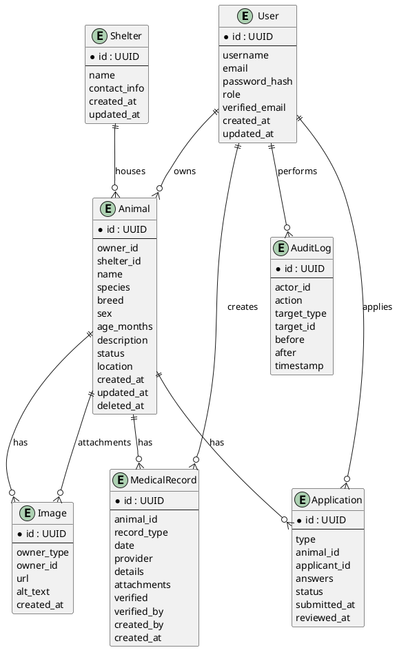

# ER Diagram & Entity Reference — 貓狗領養平台

This document contains the Entity-Relationship (ER) reference for the adoption platform. It includes canonical entity tables, attributes, relationships and a Mermaid diagram you can render locally or in supported viewers.

Notes:
- The schema below is implementation-oriented and designed to map cleanly to Prisma/Postgres.
- `VISITOR` is a non-persisted concept (anonymous session). Persisted roles: GENERAL_MEMBER, SHELTER_MEMBER, ADMIN.

## Entities & Attributes (summary)

### User
- id: UUID PK
- email: String (unique, indexed)
- username: String
- phoneNumber: String
- firstName: String
- lastName: String
- role: enum {GENERAL_MEMBER, SHELTER_MEMBER, ADMIN}
- verified: Boolean
- primaryShelterId: UUID? (FK -> Shelter.id) — optional link for single-account shelters
- profilePhotoUrl: String?
- settings: JSONB?
- createdAt: DateTime
- updatedAt: DateTime
- deletedAt: DateTime? (soft delete)

### Shelter
- id: UUID PK
- name: String
- slug: String (unique)
- contactEmail: String
- contactPhone: String
- address: JSON (street, city, region, postal)
- verified: Boolean
- primaryAccountUserId: UUID FK -> User.id
- metadata: JSONB?
- createdAt, updatedAt, deletedAt

### Animal
- id: UUID PK
- name: String
- species: enum {CAT, DOG}
- breed: String?
- sex: enum {MALE, FEMALE, UNKNOWN}
- dob: Date? (or age:int)
- description: Text
- status: enum {DRAFT, SUBMITTED, PUBLISHED, RETIRED}
- shelterId: UUID? FK -> Shelter.id
- ownerId: UUID? FK -> User.id
- medicalSummary: Text?
- createdBy: UUID FK -> User.id
- createdAt, updatedAt, deletedAt

### AnimalImage
- id: UUID PK
- animalId: UUID FK -> Animal.id
- storageKey: String
- url: String
- mimeType: String
- width: Int, height: Int
- order: Int
- createdAt

### Application
- id: UUID PK
- applicantId: UUID FK -> User.id
- animalId: UUID FK -> Animal.id
- type: enum {ADOPTION, REHOME}
- status: enum {PENDING, UNDER_REVIEW, APPROVED, REJECTED, WITHDRAWN}
- submittedAt: DateTime
- reviewedAt: DateTime?
- reviewNotes: Text?
- assigneeId: UUID? FK -> User.id
- version: Int (optimistic locking)
- idempotencyKey: String?
- attachments: JSONB? (or relation to Attachment)
- createdAt, updatedAt, deletedAt

### MedicalRecord
- id: UUID PK
- animalId: UUID FK -> Animal.id
- recordType: enum {TREATMENT, CHECKUP, VACCINE, SURGERY, OTHER}
- date: Date
- provider: String
- details: Text
- attachments: JSONB? (or FK to Attachment)
- verified: Boolean
- verifiedBy: UUID? FK -> User.id
- verifiedAt: DateTime?
- createdBy: UUID FK -> User.id
- createdAt, updatedAt, deletedAt

### Attachment
- id: UUID PK
- ownerType: enum {animal, application, medical_record, user, shelter, notification}
- ownerId: UUID
- storageKey: String
- url: String
- filename: String
- mimeType: String
- size: Int
- createdBy: UUID
- createdAt, deletedAt

### Notification
- id: UUID PK
- recipientId: UUID FK -> User.id
- actorId: UUID? FK -> User.id
- type: String
- payload: JSONB
- read: Boolean (default false)
- createdAt: DateTime
- deliveredAt: DateTime?
- externalDeliveryStatus: enum {NOT_APPLICABLE, PENDING, SENT, FAILED}
- retryCount: Int
- lastError: Text?

### Job
- id: UUID PK
- type: String (e.g., shelter:animals:import, data:export)
- status: enum {PENDING, RUNNING, SUCCEEDED, FAILED}
- payload: JSONB
- resultSummary: JSONB?
- createdBy: UUID
- createdAt, startedAt, finishedAt, attempts

### AuditLog
- id: UUID PK
- actorId: UUID? FK -> User.id
- action: String
- targetType: String
- targetId: UUID
- before: JSONB?
- after: JSONB?
- notes: Text?
- timestamp: DateTime
- shelterId: UUID?

## Relationships (high level)
- User 1..* Application (applicantId)
- Animal 1..* Application (animalId)
- Shelter 1..* Animal (shelterId)
- Animal 1..* AnimalImage
- Animal 1..* MedicalRecord
- MedicalRecord *..1 User (verifiedBy)
- User 1..* Notification (recipientId)
- Job may reference many entities via payload (application ids, file storage keys)
- AuditLog references actor (User) and target (any entity)

## Mermaid ER diagram (renderable)

## How to use
- Copy the Mermaid block into a Mermaid renderer (VSCode Mermaid preview, or Mermaid Live Editor) to visualize the ER.
- You can turn the entity attribute lists into Prisma models — tell me if you want me to generate a full Prisma schema file from these entities.

---

Generated on 2025-10-10 by automation — review fields and adapt to your DB constraints before finalizing.
# ERD（Entity Relationship Diagram）— 貓狗領養平台

此檔案提供：
- 主要資料表（實體）與欄位摘要
- 關聯（FK）與基數（cardinality）說明
- Mermaid 與 PlantUML 原始碼（可在支援的渲染器中預覽）

注意：此 ERD 以 MVP 為導向，側重於：User、Animal、Application、MedicalRecord、Image 與 AuditLog。請視需求延伸索引、分區或監控表（如 Notification、Jobs）。

---

## 實體摘要（重要欄位）
- User (id PK, username, email, passwordHash, role, verifiedEmail, createdAt, updatedAt)
- Shelter (id PK, name, contactInfo, createdAt, updatedAt)
- Animal (id PK, ownerId FK -> User.id, shelterId FK -> Shelter.id, name, species, breed, sex, ageMonths, description, status, location, createdAt, updatedAt, deletedAt)
- Image (id PK, ownerType, ownerId, url, altText, createdAt)
- Application (id PK, type, animalId FK -> Animal.id, applicantId FK -> User.id, answers JSON, status, submittedAt, reviewedAt)
- MedicalRecord (id PK, animalId FK -> Animal.id, recordType, date, provider, details, attachments JSON, verified, verifiedBy FK -> User.id, createdBy FK -> User.id)
- AuditLog (id PK, actorId FK -> User.id, action, targetType, targetId, before JSON, after JSON, timestamp)
- Conversation / Message (conversationId PK, participants[], Message: id PK, conversationId FK, senderId FK -> User.id, content, createdAt)

---

## Cardinalities（簡要）
- User 1 --- N Animal (as owner)
- Shelter 1 --- N Animal
- Animal 1 --- N Image
- Animal 1 --- N Application
- User 1 --- N Application (as applicant)
- Animal 1 --- N MedicalRecord
- User 1 --- N MedicalRecord (createdBy or verifiedBy)
- Any entity (Animal/Application/MedicalRecord) 可有多個 Image 附件（Image.ownerType + ownerId）

---

## Mermaid ER Diagram（erDiagram）

---

## PlantUML ER Diagram（可用 PlantUML 或 IDE 外掛渲染）

---

## 建議與下一步
- 若需要，我可以：
  - 將上述 PlantUML/Mermaid 轉成 SVG/PNG 並放到 `specs/002-title-description-project/assets/`。
  - 直接根據 ERD 產生完整 `schema.prisma`（包含索引與 foreign key 約束）。
  - 產生 SQL migration 模板（Postgres）與初始 migration 指令。

告訴我你想要哪一個，我會接著把圖檔或 migration 加到分支 `002-title-description-project`。