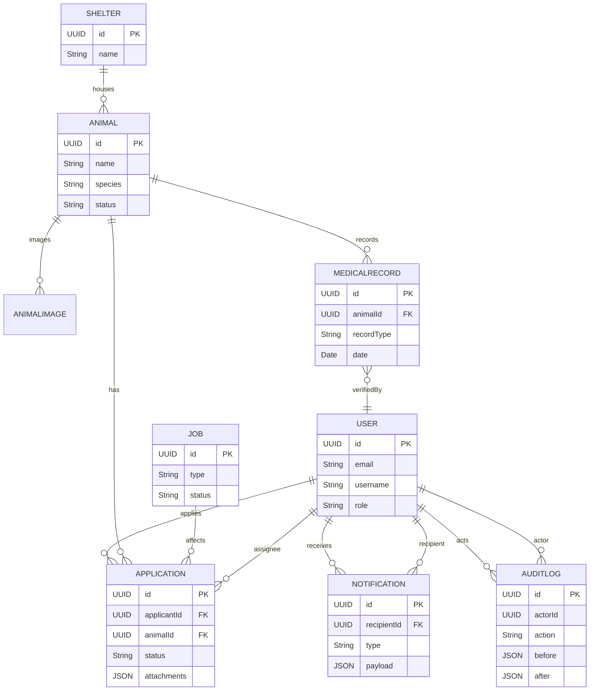
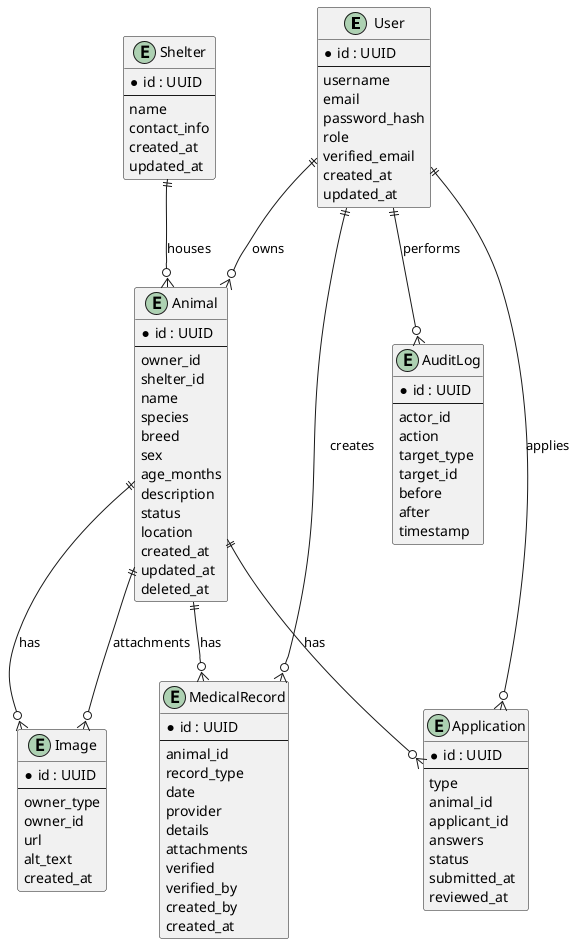

# ER Diagram & Entity Reference — 貓狗領養平台

This document contains the Entity-Relationship (ER) reference for the adoption platform. It includes canonical entity tables, attributes, relationships and a Mermaid diagram you can render locally or in supported viewers.

Notes:
- The schema below is implementation-oriented and designed to map cleanly to Prisma/Postgres.
- `VISITOR` is a non-persisted concept (anonymous session). Persisted roles: GENERAL_MEMBER, SHELTER_MEMBER, ADMIN.


## Enums (from schema.prisma)

- Role: GENERAL_MEMBER, SHELTER_MEMBER, ADMIN
- Species: CAT, DOG
- Sex: MALE, FEMALE, UNKNOWN
- AnimalStatus: DRAFT, SUBMITTED, PUBLISHED, RETIRED
- ApplicationType: ADOPTION, REHOME
- ApplicationStatus: PENDING, UNDER_REVIEW, APPROVED, REJECTED, WITHDRAWN
- MedicalRecordType: TREATMENT, CHECKUP, VACCINE, SURGERY, OTHER
- ExternalDeliveryStatus: NOT_APPLICABLE, PENDING, SENT, FAILED
- JobStatus: PENDING, RUNNING, SUCCEEDED, FAILED


## Entities & Attributes (Prisma-aligned summary)

### User
- id: String (UUID PK)
- email: String (unique)
- username: String?
- phoneNumber: String?
- firstName: String?
- lastName: String?
- role: Role (enum)
- verified: Boolean
- primaryShelterId: String? (FK -> Shelter.id) — optional link for single-account shelters
- profilePhotoUrl: String?
- settings: Json?
- createdAt: DateTime
- updatedAt: DateTime
- deletedAt: DateTime?

Relations:
- applications: Application[] (@relation("ApplicantApplications"))
- notifications: Notification[]
- animalsOwned: Animal[] (@relation("OwnerAnimals"))
- assignedApps: Application[] (@relation("AssigneeApplications"))
- createdRecords: MedicalRecord[] (@relation("CreatorRecords"))
- verifiedRecords: MedicalRecord[] (@relation("VerifierRecords"))

### Shelter
- id: String (UUID PK)
- name: String
- slug: String (unique)
- contactEmail: String?
- contactPhone: String?
- address: Json?
- verified: Boolean
- primaryAccountUserId: String? (FK -> User.id) — primary account user for this shelter
- metadata: Json?
- createdAt, updatedAt, deletedAt

Relations:
- animals: Animal[]
- auditLogs: AuditLog[]

### Animal
- id: String (UUID PK)
- name: String
- species: Species
- breed: String?
- sex: Sex
- dob: DateTime?
- description: String?
- status: AnimalStatus
- shelterId: String? (FK -> Shelter.id)
- ownerId: String? (FK -> User.id) — references a GENERAL_MEMBER when present; for shelter-owned animals prefer shelterId
- medicalSummary: String?
- createdBy: String? (FK -> User.id)
- createdAt, updatedAt, deletedAt

Relations:
- images: AnimalImage[]
- medicalRecords: MedicalRecord[]
- applications: Application[]

Indexes:
- @@index([shelterId])
- @@index([ownerId])

### AnimalImage
- id: String (UUID PK)
- animalId: String (FK -> Animal.id)
- storageKey: String
- url: String
- mimeType: String?
- width: Int?
- height: Int?
- order: Int?
- createdAt: DateTime

### Application
- id: String (UUID PK)
- applicantId: String (FK -> User.id)
- animalId: String (FK -> Animal.id)
- type: ApplicationType
- status: ApplicationStatus
- submittedAt: DateTime
- reviewedAt: DateTime?
- reviewNotes: String?
- assigneeId: String? (FK -> User.id)
- version: Int (optimistic locking)
- idempotencyKey: String?
- attachments: Json?
- createdAt, updatedAt, deletedAt

Indexes:
- @@index([applicantId, status])
- @@index([animalId])

### MedicalRecord
- id: String (UUID PK)
- animalId: String (FK -> Animal.id)
- recordType: MedicalRecordType
- date: DateTime
- provider: String?
- details: String?
- attachments: Json?
- verified: Boolean
- verifiedBy: String? (FK -> User.id)
- createdBy: String (FK -> User.id)
- createdAt, updatedAt, deletedAt

Indexes:
- @@index([animalId])

### Attachment
- id: String (UUID PK)
- ownerType: String
- ownerId: String
- storageKey: String
- url: String
- filename: String
- mimeType: String
- size: Int
- createdBy: String
- createdAt: DateTime
- deletedAt: DateTime?

### Notification
- id: String (UUID PK)
- recipientId: String (FK -> User.id)
- actorId: String? (FK -> User.id)
- type: String
- payload: Json?
- read: Boolean
- createdAt: DateTime
- deliveredAt: DateTime?
- externalDeliveryStatus: ExternalDeliveryStatus
- retryCount: Int
- lastError: String?

Indexes:
- @@index([recipientId, read])

### Job
- id: String (UUID PK)
- type: String
- status: JobStatus
- payload: Json?
- resultSummary: Json?
- createdBy: String? (FK -> User.id)
- createdAt, startedAt, finishedAt, attempts

### AuditLog
- id: String (UUID PK)
- actorId: String? (FK -> User.id)
- action: String
- targetType: String
- targetId: String?
- before: Json?
- after: Json?
- notes: String?
- timestamp: DateTime
- shelterId: String? (FK -> Shelter.id)

Indexes:
- @@index([actorId])


## Relationships (high level)
- User 1..* Application (applicantId)
- Animal 1..* Application (animalId)
- Shelter 1..* Animal (shelterId)
- Animal 1..* AnimalImage
- Animal 1..* MedicalRecord
- MedicalRecord *..1 User (verifiedBy)
- User 1..* Notification (recipientId)
- Job may reference many entities via payload (application ids, file storage keys)
- AuditLog references actor (User) and target (any entity)


## Mermaid ER diagram (renderable)




## How to use
- Copy the Mermaid block into a Mermaid renderer (VSCode Mermaid preview, or Mermaid Live Editor) to visualize the ER.
- You can turn the entity attribute lists into Prisma models — tell me if you want me to generate a full Prisma schema file from these entities.

---

Generated on 2025-10-10 by automation — review fields and adapt to your DB constraints before finalizing.
# ERD（Entity Relationship Diagram）— 貓狗領養平台

此檔案提供：
- 主要資料表（實體）與欄位摘要
- 關聯（FK）與基數（cardinality）說明
- Mermaid 與 PlantUML 原始碼（可在支援的渲染器中預覽）

注意：此 ERD 以 MVP 為導向，側重於：User、Animal、Application、MedicalRecord、Image 與 AuditLog。請視需求延伸索引、分區或監控表（如 Notification、Jobs）。

---

## 實體摘要（重要欄位）
- User (id PK, username, email, passwordHash, role, verifiedEmail, createdAt, updatedAt)
- Shelter (id PK, name, contactInfo, createdAt, updatedAt)
- Animal (id PK, ownerId FK -> User.id, shelterId FK -> Shelter.id, name, species, breed, sex, ageMonths, description, status, location, createdAt, updatedAt, deletedAt)
- Image (id PK, ownerType, ownerId, url, altText, createdAt)
- Application (id PK, type, animalId FK -> Animal.id, applicantId FK -> User.id, answers JSON, status, submittedAt, reviewedAt)
- MedicalRecord (id PK, animalId FK -> Animal.id, recordType, date, provider, details, attachments JSON, verified, verifiedBy FK -> User.id, createdBy FK -> User.id)
-- AuditLog (id PK, actorId FK -> User.id, action, targetType, targetId, before JSON, after JSON, timestamp)
- Conversation / Message: DEFERRED for MVP (in-app direct messaging is out of scope for this release). If introduced later, model as (conversationId PK, participants[], Message: id PK, conversationId FK, senderId FK -> User.id, content, createdAt).

---

## Cardinalities（簡要）
- User 1 --- N Animal (as owner)
- Shelter 1 --- N Animal
- Animal 1 --- N Image
- Animal 1 --- N Application
- User 1 --- N Application (as applicant)
- Animal 1 --- N MedicalRecord
- User 1 --- N MedicalRecord (createdBy or verifiedBy)
- Any entity (Animal/Application/MedicalRecord) 可有多個 Image 附件（Image.ownerType + ownerId）

---

## Mermaid ER Diagram（erDiagram）

```mermaid
erDiagram
    %% =======================
    %% Tables / Entities
    %% =======================
    USER {
        STRING id PK
        STRING email UNIQUE
        STRING username
        STRING phoneNumber
        STRING firstName
        STRING lastName
        STRING role
        BOOLEAN verified
        STRING primaryShelterId
        STRING profilePhotoUrl
        TEXT settings
        DATETIME createdAt
        DATETIME updatedAt
        DATETIME deletedAt
    }

    SHELTER {
        STRING id PK
        STRING name
        STRING slug UNIQUE
        STRING contactEmail
        STRING contactPhone
        TEXT address
        BOOLEAN verified
        STRING primaryAccountUserId
        TEXT metadata
        DATETIME createdAt
        DATETIME updatedAt
        DATETIME deletedAt
    }

    ANIMAL {
        STRING id PK
        STRING name
        STRING species
        STRING breed
        STRING sex
        DATETIME dob
        STRING description
        STRING status
        STRING shelterId
        STRING ownerId
        STRING medicalSummary
        STRING createdBy
        DATETIME createdAt
        DATETIME updatedAt
        DATETIME deletedAt
    }

    ANIMALIMAGE {
        STRING id PK
        STRING animalId
        STRING storageKey
        STRING url
        STRING mimeType
        INT width
        INT height
        INT order
        DATETIME createdAt
    }

    APPLICATION {
        STRING id PK
        STRING applicantId
        STRING animalId
        STRING type
        STRING status
        DATETIME submittedAt
        DATETIME reviewedAt
        STRING reviewNotes
        STRING assigneeId
        INT version
        STRING idempotencyKey
        TEXT attachments
        DATETIME createdAt
        DATETIME updatedAt
        DATETIME deletedAt
    }

    MEDICALRECORD {
        STRING id PK
        STRING animalId
        STRING recordType
        DATETIME date
        STRING provider
        STRING details
        TEXT attachments
        BOOLEAN verified
        STRING verifiedBy
        STRING createdBy
        DATETIME createdAt
        DATETIME updatedAt
        DATETIME deletedAt
    }

    ATTACHMENT {
        STRING id PK
        STRING ownerType
        STRING ownerId
        STRING storageKey
        STRING url
        STRING filename
        STRING mimeType
        INT size
        STRING createdBy
        DATETIME createdAt
        DATETIME deletedAt
    }

    NOTIFICATION {
        STRING id PK
        STRING recipientId
        STRING actorId
        STRING type
        TEXT payload
        BOOLEAN read
        DATETIME createdAt
        DATETIME deliveredAt
        STRING externalDeliveryStatus
        INT retryCount
        STRING lastError
    }

    JOB {
        STRING id PK
        STRING type
        STRING status
        TEXT payload
        TEXT resultSummary
        STRING createdBy
        DATETIME createdAt
        DATETIME startedAt
        DATETIME finishedAt
        INT attempts
    }

    AUDITLOG {
        STRING id PK
        STRING actorId
        STRING action
        STRING targetType
        STRING targetId
        TEXT before
        TEXT after
        STRING notes
        DATETIME timestamp
        STRING shelterId
    }

    %% =======================
    %% Relationships
    %% =======================
    USER ||--o{ APPLICATION : "applicant_applications"
    USER ||--o{ APPLICATION : "assignee_applications"
    USER ||--o{ ANIMAL : "owner_animals"
    USER ||--o{ MEDICALRECORD : "creator_records"
    USER ||--o{ MEDICALRECORD : "verifier_records"
    USER ||--o{ NOTIFICATION : "recipient_notifications"
    USER ||--o{ JOB : "jobs_created"
    USER ||--o{ AUDITLOG : "actor_auditlogs"

    SHELTER ||--o{ ANIMAL : "animals"
    SHELTER ||--o{ AUDITLOG : "shelter_auditlogs"

    ANIMAL ||--o{ ANIMALIMAGE : "images"
    ANIMAL ||--o{ MEDICALRECORD : "medical_records"
    ANIMAL ||--o{ APPLICATION : "applications"

    ANIMAL ||--o{ ATTACHMENT : "attachments"

```

---

## PlantUML ER Diagram（可用 PlantUML 或 IDE 外掛渲染）



---