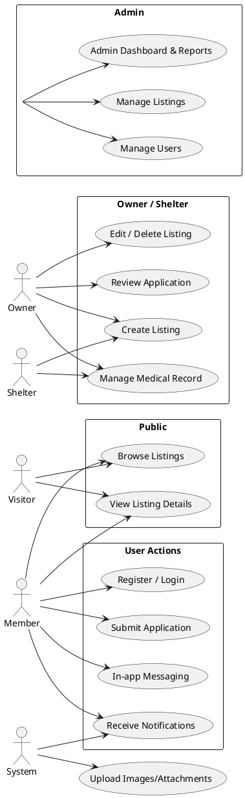

# Use Case 圖與說明 — 貓狗領養平台

此文件包含：
- 主要演員（Actors）與使用案例（Use Cases）清單
- Mermaid 與 PlantUML 的 Use Case 圖原始碼（可在支援的渲染器中預覽）
- 範例主要成功路徑（Primary Success Scenario）與例外情境

## 主要演員 (Actors)
- 訪客 (Visitor)：未登入的任何人，可瀏覽公開的動物刊登、查看列表與細節。
- 會員 (Member)：註冊並登入的使用者，可申請領養、儲存收藏、發送訊息、檢視申請狀態。
- 飼主 / 送養者 (Owner)：擁有或管理某則動物刊登的會員，可建立/編輯/下架刊登、回覆申請。
- 收容所 (Shelter)：以機構身份管理多筆動物刊登（邏輯上與 Owner 類似，可視為特殊角色）。
- 管理員 (Admin)：平台管理員，可審核刊登、管理使用者、處理違規、查看報告。
- 系統 (System)：負責發送通知、排程工作、發出簽名 URL 等自動化流程。
- 檢驗者/獸醫 (Verifier/Vet)(選用)：負責核實醫療紀錄（若實作醫療驗證流程）。

## 主要使用案例（Use Cases）
- UC-01: 瀏覽動物列表 (Browse Listings)
- UC-02: 查看動物細節 (View Listing Details)
- UC-03: 註冊 / 登入 (Register / Login)
- UC-04: 建立動物刊登 (Create Listing)
- UC-05: 編輯 / 刪除刊登 (Edit / Delete Listing)
- UC-06: 上傳圖片與附件 (Upload Images/Attachments)
- UC-07: 送出領養申請 (Submit Application)
- UC-08: 審核申請 (Review Application)
- UC-09: 管理醫療紀錄 (Add/Edit Medical Record)
- UC-10: 驗證醫療紀錄 (Verify Medical Record)
- UC-11: 站內訊息 (In-app Messaging)
- UC-12: 收到通知 (Receive Notifications)
- UC-13: 管理後台與報告 (Admin Dashboard & Reports)

---

## Mermaid Use Case 圖（可在支援 Mermaid 的 editor 預覽）

```mermaid
%%{init: {"theme":"default"}}%%
usecaseDiagram

actor Visitor as V
actor Member as M
actor Owner as O
actor Shelter as S
actor Admin as A
actor System as Sys

V --> (Browse Listings)
V --> (View Listing Details)

M --> (Register / Login)
M --> (Browse Listings)
M --> (View Listing Details)
M --> (Submit Application)
M --> (In-app Messaging)
M --> (Receive Notifications)

O --> (Create Listing)
O --> (Edit / Delete Listing)
O --> (Review Application)
O --> (Manage Medical Record)

S --> (Create Listing)
S --> (Manage Medical Record)

A --> (Review Application)
A --> (Manage Listings)
A --> (Manage Users)
A --> (Admin Dashboard & Reports)

Sys --> (Receive Notifications)
Sys --> (Upload Images/Attachments)

(Browse Listings) .> (View Listing Details) : include
(Submit Application) .> (In-app Messaging) : include
(Manage Medical Record) .> (Verify Medical Record) : extend
```

---

## PlantUML Use Case 圖（適合使用 PlantUML/IDE 擴充套件渲染）



---

## 範例使用案例細節：UC-07 送出領養申請（Submit Application）

Primary Actor: Member
Stakeholders: Applicant, Animal Owner, Admin
Preconditions: 使用者已登入；動物狀態為 PUBLISHED
Trigger: 使用者在動物詳情頁按下「送出申請」

Main Success Scenario:
1. Applicant 開啟動物詳情頁，按下「送出申請」。
2. 系統顯示申請表單（含問題、聯絡資訊、行為金錢承諾等欄位）。
3. Applicant 填寫表單並上傳必要附件（身分證明、居住證明等）。
4. Applicant 提交申請；系統建立 Application（status = PENDING），紀錄 submittedAt，並觸發通知給 Owner 與 Admin。
5. Owner/Assigned admin 在後台看到新申請，開始審核（轉為 UNDER_REVIEW）。
6. 若審核通過，Owner/ Admin 將 Application 設為 APPROVED，系統通知 Applicant（並觸發後續領養流程：安排面談或交接）。

Extensions / Exception Flows:
- 3a. 若必填欄位遺漏，系統回傳錯誤並顯示欄位驗證訊息。
- 4a. 若 Applicant 在相同 animalId 已有未結案申請，系統阻止重複送出或提示更新現有申請。
- 4b. 附件上傳失敗：系統回滾申請建立、記錄錯誤，提示 Applicant 重試或稍後再試。

Success End Condition: Application 狀態為 PENDING 並通知已送出。

---

## 建議（如何使用此檔案）
- 若要在 README 或 Confluence 嵌入圖形，請使用支援 Mermaid 或 PlantUML 的渲染器。
- 我可以把 Mermaid 圖轉成 SVG/PNG 並放入 `specs/002-title-description-project/assets/`（需要你允許我產生圖片檔）。
- 若你有特定的 UML 工具偏好（PlantUML 或 draw.io），告訴我，我會輸出相應格式或直接建立檔案。

---

文件位置：`specs/002-title-description-project/use-cases.md`

如果你想要我把這個 Use Case 圖放進 README 或自動建立 PR，告訴我下一步。