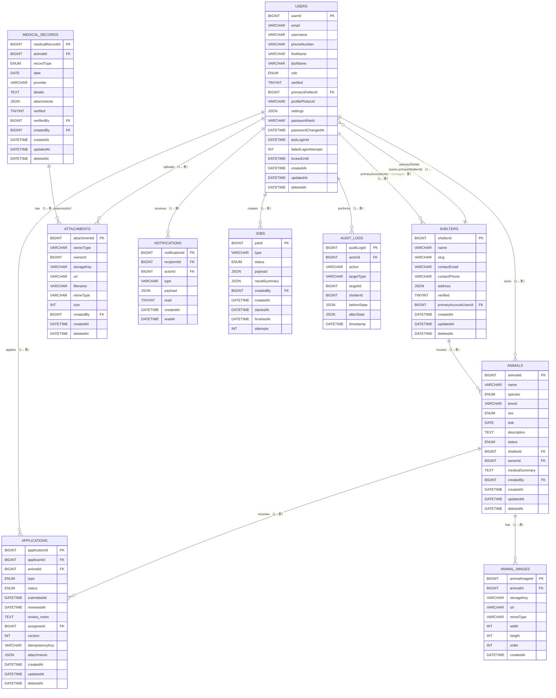

````markdown
# ERD → SQL (MySQL) — CREATE TABLEs and attribute descriptions

This file translates the ERD (`erd-generated.md`) into MySQL-compatible CREATE TABLE statements and documents each attribute with recommended datatypes, constraints, indexes and notes. Target: MySQL 8+ (InnoDB), CHARACTER SET utf8mb4.

Notes
- This document is intentionally prescriptive for Alembic/SQL migrations. Adjust lengths/indexes as needed for your workload.
- Polymorphic `attachments` use `ownerType` + `ownerId` (no DB foreign key). Application logic is responsible for integrity.

---

## conventions
- id columns are BIGINT UNSIGNED AUTO_INCREMENT for numeric PKs.
- timestamp fields use DATETIME(6) for microsecond precision.
- JSON uses native JSON type (MySQL 5.7+).
- soft-delete uses `deletedAt` DATETIME(6) NULL.

---

## users

```sql
CREATE TABLE users (
  userId BIGINT UNSIGNED NOT NULL AUTO_INCREMENT,
  email VARCHAR(320) NOT NULL,
  username VARCHAR(150) DEFAULT NULL,
  phoneNumber VARCHAR(32) DEFAULT NULL,
  firstName VARCHAR(120) DEFAULT NULL,
  lastName VARCHAR(120) DEFAULT NULL,
  role ENUM('GENERAL_MEMBER','SHELTER_MEMBER','ADMIN') NOT NULL DEFAULT 'GENERAL_MEMBER',
  verified TINYINT(1) NOT NULL DEFAULT 0,
  primaryShelterId BIGINT UNSIGNED DEFAULT NULL,
  profilePhotoUrl VARCHAR(1024) DEFAULT NULL,
  settings JSON DEFAULT NULL,
  passwordHash VARCHAR(255) NOT NULL,
  passwordChangedAt DATETIME(6) DEFAULT NULL,
  lastLoginAt DATETIME(6) DEFAULT NULL,
  failedLoginAttempts INT DEFAULT 0,
  lockedUntil DATETIME(6) DEFAULT NULL,
  createdAt DATETIME(6) NOT NULL DEFAULT CURRENT_TIMESTAMP(6),
  updatedAt DATETIME(6) NOT NULL DEFAULT CURRENT_TIMESTAMP(6) ON UPDATE CURRENT_TIMESTAMP(6),
  deletedAt DATETIME(6) DEFAULT NULL,
  PRIMARY KEY (userId),
  UNIQUE KEY uq_users_email (email),
  KEY idx_users_primary_shelter (primaryShelterId),
  CONSTRAINT fk_users_primary_shelter FOREIGN KEY (primaryShelterId) REFERENCES shelters(shelterId) ON DELETE SET NULL
 ) CHARACTER SET=utf8mb4 COLLATE=utf8mb4_unicode_ci;
```

- Attributes
- Attributes (中文說明)
- userId: 主鍵 (BIGINT UNSIGNED)，自動遞增，用於唯一識別使用者。系統內引用此 userId 作為外鍵。
- email: 電子郵件（VARCHAR(320)），做為登入識別與聯絡管道，必須唯一以避免重複帳號。
- username: 使用者公開顯示的帳號或暱稱（選填），用於 UI 顯示或短網址。
- phoneNumber: 使用者電話（建議以 E.164 格式儲存），可用於雙因素驗證或聯絡。
- firstName / lastName: 使用者姓名分欄，便於排序、顯示與信件稱呼。
- role: 角色欄（ENUM），代表使用者的角色/身分（GENERAL_MEMBER / SHELTER_MEMBER / ADMIN），用於授權檢查。
- verified: 是否已驗證電子郵件（布林），在未驗證時限制某些操作（例如刊登或送養）。
- primaryShelterId: 使用者所屬或代表的主要收容所 id（FK，nullable），便於權限與資料隔離。
- profilePhotoUrl: 使用者頭像檔案的 URL（可為 CDN 或 presigned URL）。
- settings: JSON，儲存使用者偏好（UI 設定、通知偏好、語言等）。
- createdAt / updatedAt: 建立與更新時間戳，使用微秒精度以利追蹤與排序。
- deletedAt: 軟刪除時間戳；若不為 NULL 表示帳號已被刪除但保留紀錄。查詢時通常排除已刪除的帳號。
- passwordHash: 密碼雜湊（例如 bcrypt/argon2 的結果），永遠不要儲存明文密碼。
- passwordChangedAt: 使用者上次變更密碼的時間（可用於強制要求重新登入或失效舊 token）。
- lastLoginAt: 使用者最近一次成功登入時間（供審計與安全通知）。
- failedLoginAttempts: 連續失敗的登入次數，用於實作鎖定策略或 threshold-based 風控。
- lockedUntil: 若因多次失敗而暫時鎖定帳號，記錄解鎖時間（timestamp），NULL 表示未鎖定。

---

## shelters

```sql
CREATE TABLE shelters (
  shelterId BIGINT UNSIGNED NOT NULL AUTO_INCREMENT,
  name VARCHAR(255) NOT NULL,
  slug VARCHAR(255) NOT NULL,
  contactEmail VARCHAR(320) DEFAULT NULL,
  contactPhone VARCHAR(32) DEFAULT NULL,
  address JSON DEFAULT NULL,
  verified TINYINT(1) NOT NULL DEFAULT 0,
  primaryAccountUserId BIGINT UNSIGNED DEFAULT NULL,
  createdAt DATETIME(6) NOT NULL DEFAULT CURRENT_TIMESTAMP(6),
  updatedAt DATETIME(6) NOT NULL DEFAULT CURRENT_TIMESTAMP(6) ON UPDATE CURRENT_TIMESTAMP(6),
  deletedAt DATETIME(6) DEFAULT NULL,
  PRIMARY KEY (shelterId),
  UNIQUE KEY uq_shelters_slug (slug),
  KEY idx_shelters_primary_account (primaryAccountUserId),
  CONSTRAINT fk_shelters_primary_account FOREIGN KEY (primaryAccountUserId) REFERENCES users(userId) ON DELETE SET NULL
 ) CHARACTER SET=utf8mb4 COLLATE=utf8mb4_unicode_ci;
```

- Attributes
- Attributes (中文說明)
- shelterId: 主鍵 (BIGINT UNSIGNED)，收容所唯一識別。
- name: 收容所正式名稱，用於顯示與搜尋。
- slug: 人類可讀且唯一的字串，常用於路由與公開網址（避免曝光內部 id）。
- contactEmail / contactPhone: 對外聯絡資訊，用於信件通知或客服。
- address: JSON 格式的地址欄位，可包含街道、城市、縣市與郵遞區號，便於顯示與地圖整合。
- verified: 收容所是否通過系統系統管理員（布林），影響是否可被標註為「官方認可」。
- primaryAccountUserId: 指向管理此收容所的主要使用者（FK），用於角色與通知路徑。

---

## animals

```sql
CREATE TABLE animals (
  animalId BIGINT UNSIGNED NOT NULL AUTO_INCREMENT,
  name VARCHAR(200) DEFAULT NULL,
  species ENUM('CAT','DOG') DEFAULT NULL,
  breed VARCHAR(200) DEFAULT NULL,
  sex ENUM('MALE','FEMALE','UNKNOWN') DEFAULT 'UNKNOWN',
  dob DATE DEFAULT NULL,
  description TEXT DEFAULT NULL,
  status ENUM('DRAFT','SUBMITTED','PUBLISHED','RETIRED') NOT NULL DEFAULT 'DRAFT',
  shelterId    DEFAULT NULL,
  ownerId BIGINT UNSIGNED DEFAULT NULL,
  medicalSummary TEXT DEFAULT NULL,
  createdBy BIGINT UNSIGNED DEFAULT NULL,
  createdAt DATETIME(6) NOT NULL DEFAULT CURRENT_TIMESTAMP(6),
  updatedAt DATETIME(6) NOT NULL DEFAULT CURRENT_TIMESTAMP(6) ON UPDATE CURRENT_TIMESTAMP(6),
  deletedAt DATETIME(6) DEFAULT NULL,
  PRIMARY KEY (animalId),
  KEY idx_animals_shelter (shelterId),
  KEY idx_animals_status (status),
  CONSTRAINT fk_animals_shelter FOREIGN KEY (shelterId) REFERENCES shelters(shelterId) ON DELETE SET NULL,
  CONSTRAINT fk_animals_owner FOREIGN KEY (ownerId) REFERENCES users(userId) ON DELETE SET NULL
 ) CHARACTER SET=utf8mb4 COLLATE=utf8mb4_unicode_ci;
```

- Attributes
- Attributes (中文說明)
- animalId: 主鍵 (BIGINT UNSIGNED)。
- name: 動物的稱呼或暱稱，供前端卡片與列表顯示。
- species: 動物種類（ENUM CAT/DOG），便於分類與篩選。
- breed: 品種欄位，用於細分搜尋與顯示。
- sex: 性別（ENUM），可能影響年齡或醫療建議。
- dob: 出生日期（若已知），可用於計算年齡。
- description: 文字敘述，包括性情、背景故事或特殊需求。
- status: 工作流程狀態（DRAFT: 草稿, SUBMITTED: 已送審, PUBLISHED: 上架, RETIRED: 下架），控制是否曝光與可申請。
- shelterId: 若動物由收容所管理，記錄該 shelter 的 id（FK）。
- ownerId: 若有原持有人或個人刊登者，紀錄 user id。
- medicalSummary: 針對醫療資訊的摘要（例如疫苗、手術、慢性病），常用於列表快覽。
- createdBy: 建立紀錄的使用者 id（FK），便於追溯與權限判斷。
- createdAt / updatedAt / deletedAt: 時間戳與軟刪除。

---

## animal_images

```sql
CREATE TABLE animal_images (
  animalImageId BIGINT UNSIGNED NOT NULL AUTO_INCREMENT,
  animalId BIGINT UNSIGNED NOT NULL,
  storageKey VARCHAR(1024) NOT NULL,
  url VARCHAR(2048) NOT NULL,
  mimeType VARCHAR(128) DEFAULT NULL,
  width INT DEFAULT NULL,
  height INT DEFAULT NULL,
  `order` INT DEFAULT 0,
  createdAt DATETIME(6) NOT NULL DEFAULT CURRENT_TIMESTAMP(6),
  PRIMARY KEY (animalImageId),
  KEY idx_animal_images_animal (animalId),
  CONSTRAINT fk_animal_images_animal FOREIGN KEY (animalId) REFERENCES animals(animalId) ON DELETE CASCADE
 ) CHARACTER SET=utf8mb4 COLLATE=utf8mb4_unicode_ci;
```

- Attributes
- Attributes (中文說明)
- animalImageId: 主鍵。
- animalId: 外鍵，指向所屬 animal，用於查詢該動物所有圖片。
- storageKey: object storage（S3/MinIO）內的物件鍵，用於直接上傳/下載。
- url: 圖片對外存取的 URL（可為 CDN URL 或 presigned URL），供前端顯示。
- mimeType: 檔案 MIME 類型，便於前端判斷顯示方式或驗證上傳檔案類型。
- width / height: 影像寬高（像素），可用於產生佔位圖或 lazy loading 決策。
- order: 圖片的顯示順序（整數），用於排序。
- createdAt: 上傳/紀錄時間。

---

## applications

```sql
CREATE TABLE applications (
  applicationId BIGINT UNSIGNED NOT NULL AUTO_INCREMENT,
  applicantId BIGINT UNSIGNED NOT NULL,
  animalId BIGINT UNSIGNED NOT NULL,
  type ENUM('ADOPTION','REHOME') NOT NULL,
  status ENUM('PENDING','UNDER_REVIEW','APPROVED','REJECTED','WITHDRAWN') NOT NULL DEFAULT 'PENDING',
  submittedAt DATETIME(6) DEFAULT NULL,
  reviewedAt DATETIME(6) DEFAULT NULL,
  review_notes TEXT DEFAULT NULL,
  assigneeId BIGINT UNSIGNED DEFAULT NULL,
  version INT NOT NULL DEFAULT 1,
  idempotencyKey VARCHAR(255) DEFAULT NULL,
  attachments JSON DEFAULT NULL,
  createdAt DATETIME(6) NOT NULL DEFAULT CURRENT_TIMESTAMP(6),
  updatedAt DATETIME(6) NOT NULL DEFAULT CURRENT_TIMESTAMP(6) ON UPDATE CURRENT_TIMESTAMP(6),
  deletedAt DATETIME(6) DEFAULT NULL,
  PRIMARY KEY (applicationId),
  KEY idx_applications_applicant (applicantId),
  KEY idx_applications_animal (animalId),
  CONSTRAINT fk_applications_applicant FOREIGN KEY (applicantId) REFERENCES users(userId) ON DELETE CASCADE,
  CONSTRAINT fk_applications_animal FOREIGN KEY (animalId) REFERENCES animals(animalId) ON DELETE CASCADE
 ) CHARACTER SET=utf8mb4 COLLATE=utf8mb4_unicode_ci;
```

- Attributes
- Attributes (中文說明)
- applicationId: 主鍵。
- applicantId: 申請人 user id（FK），代表誰提出申請。
- animalId: 申請對象的 animal id（FK）。
- type: 申請類型（ADOPTION 或 REHOME），影響後續流程與驗證條件。
- status: 申請狀態（PENDING / UNDER_REVIEW / APPROVED / REJECTED / WITHDRAWN）。
- submittedAt / reviewedAt: 提交與審核時間，用於審計與 SLA 計算。
- review_notes: 審核者留下的文字備註（理由或拒絕原因）。
- assigneeId: 負責處理該申請的審核者 user id（FK）。
- version: 樂觀鎖欄位（int），在更新時檢查以避免競爭條件。
- idempotencyKey: 用於 POST 去重，避免重複建立相同申請（例如 client 重試情況）。
- attachments: JSON 陣列，儲存申請所附檔案的 metadata 或 attachment ids。
- createdAt / updatedAt / deletedAt: 時間戳與軟刪除欄位。

---

## medical_records

```sql
CREATE TABLE medical_records (
  medicalRecordId BIGINT UNSIGNED NOT NULL AUTO_INCREMENT,
  animalId BIGINT UNSIGNED NOT NULL,
  recordType ENUM('TREATMENT','CHECKUP','VACCINE','SURGERY','OTHER') DEFAULT 'OTHER',
  `date` DATE DEFAULT NULL,
  provider VARCHAR(255) DEFAULT NULL,
  details TEXT DEFAULT NULL,
  attachments JSON DEFAULT NULL,
  verified TINYINT(1) NOT NULL DEFAULT 0,
  verifiedBy BIGINT UNSIGNED DEFAULT NULL,
  createdBy BIGINT UNSIGNED DEFAULT NULL,
  createdAt DATETIME(6) NOT NULL DEFAULT CURRENT_TIMESTAMP(6),
  updatedAt DATETIME(6) NOT NULL DEFAULT CURRENT_TIMESTAMP(6) ON UPDATE CURRENT_TIMESTAMP(6),
  deletedAt DATETIME(6) DEFAULT NULL,
  PRIMARY KEY (medicalRecordId),
  KEY idx_medical_records_animal (animalId),
  CONSTRAINT fk_medical_records_animal FOREIGN KEY (animalId) REFERENCES animals(animalId) ON DELETE CASCADE,
  CONSTRAINT fk_medical_records_verified_by FOREIGN KEY (verifiedBy) REFERENCES users(userId) ON DELETE SET NULL
)
CHARACTER SET=utf8mb4 COLLATE=utf8mb4_unicode_ci;
```

- Attributes
- Attributes (中文說明)
- medicalRecordId: 主鍵。
- animalId: 外鍵，對應該紀錄所屬的 animal。
- recordType: 醫療紀錄類型（例如 TREATMENT、VACCINE），用於分類與過濾。
- date: 紀錄發生日期（若已知）。
- provider: 提供醫療服務者或醫療機構名稱（文字）。
- details: 記錄詳述（文本），包含診斷、處置、醫囑等。
- attachments: JSON 陣列，連結相關檔案（例如病歷表、影像、檢驗結果）。
- verified: 布林，表示該紀錄是否已經被授權人員驗證。
- verifiedBy: 驗證者的 user id（FK），在驗證時填入，用於追蹤誰完成驗證。
- createdBy: 建立此紀錄的使用者 id（FK），通常是上傳或輸入紀錄的人。
- createdAt / updatedAt / deletedAt: 時間戳與軟刪除欄位。

---

## attachments

```sql
CREATE TABLE attachments (
  attachmentId BIGINT UNSIGNED NOT NULL AUTO_INCREMENT,
  ownerType VARCHAR(64) NOT NULL,
  ownerId BIGINT UNSIGNED NOT NULL,
  storageKey VARCHAR(1024) NOT NULL,
  url VARCHAR(2048) NOT NULL,
  filename VARCHAR(1024) DEFAULT NULL,
  mimeType VARCHAR(128) DEFAULT NULL,
  size INT DEFAULT NULL,
  createdBy BIGINT UNSIGNED DEFAULT NULL,
  createdAt DATETIME(6) NOT NULL DEFAULT CURRENT_TIMESTAMP(6),
  deletedAt DATETIME(6) DEFAULT NULL,
  PRIMARY KEY (attachmentId),
  KEY idx_attachments_owner (ownerType, ownerId),
  CONSTRAINT fk_attachments_created_by FOREIGN KEY (createdBy) REFERENCES users(userId) ON DELETE SET NULL
)
 
CHARACTER SET=utf8mb4 COLLATE=utf8mb4_unicode_ci;
```

- Attributes
- Attributes (中文說明)
- attachmentId: 主鍵。
- ownerType: 表示此附件屬於哪種類型的實體（例如 'animal', 'application', 'medical_record'），用於在應用層解析擁有者。
- ownerId: 與 ownerType 配合，表示具體的資源 id（例如 animal.id 或 application.id）。此欄不是 DB FK，而是應用層維護關聯。
- storageKey: 在 object storage 中的鍵值，用於直接上傳/下載。
- url: 可供前端顯示或下載的完整 URL（可能為經由 CDN 的網址）。
- filename: 原始檔名，方便展示與下載時使用者識別。
- mimeType: 檔案類型（image/jpeg, application/pdf 等），可用於安全檢查或顯示判斷。
- size: 檔案大小（位元組），可用於 quota 與顯示。
- createdBy: 建立該附件的 user id（FK），方便追蹤上傳者。
- createdAt / deletedAt: 上傳時間與軟刪除時間。

---

## notifications

```sql
CREATE TABLE notifications (
  notificationId BIGINT UNSIGNED NOT NULL AUTO_INCREMENT,
  recipientId BIGINT UNSIGNED NOT NULL,
  actorId BIGINT UNSIGNED DEFAULT NULL,
  type VARCHAR(128) NOT NULL,
  payload JSON DEFAULT NULL,
  `read` TINYINT(1) NOT NULL DEFAULT 0,
  createdAt DATETIME(6) NOT NULL DEFAULT CURRENT_TIMESTAMP(6),
  readAt DATETIME(6) DEFAULT NULL,
  PRIMARY KEY (notificationId),
  KEY idx_notifications_recipient (recipientId),
  CONSTRAINT fk_notifications_recipient FOREIGN KEY (recipientId) REFERENCES users(userId) ON DELETE CASCADE
) 
CHARACTER SET=utf8mb4 COLLATE=utf8mb4_unicode_ci;
```

- Attributes
- Attributes (中文說明)
- notificationId: 主鍵。
- recipientId: 接收者 user id（FK），是查詢通知的主要索引。
- actorId: 執行該動作的 user id（可為 NULL，例如系統通知）。
- type: 通知類型字串（例如 'application_submitted'），用於選擇 template 與處理邏輯。
- payload: JSON，儲存模板變數或原始事件資料，供通知服務解析並送出。
- read: 是否已讀（布林）；用於前端顯示未讀 badge。
- createdAt : 建立時間。
- readAt：讀取的時間。
---

## jobs

```sql
CREATE TABLE jobs (
  jobId BIGINT UNSIGNED NOT NULL AUTO_INCREMENT,
  type VARCHAR(128) NOT NULL,
  status ENUM('PENDING','RUNNING','SUCCEEDED','FAILED') NOT NULL DEFAULT 'PENDING',
  payload JSON DEFAULT NULL,
  resultSummary JSON DEFAULT NULL,
  createdBy BIGINT UNSIGNED DEFAULT NULL,
  createdAt DATETIME(6) NOT NULL DEFAULT CURRENT_TIMESTAMP(6),
  startedAt DATETIME(6) DEFAULT NULL,
  finishedAt DATETIME(6) DEFAULT NULL,
  attempts INT DEFAULT 0,
  KEY idx_jobs_status (status),
  CONSTRAINT fk_jobs_created_by FOREIGN KEY (createdBy) REFERENCES users(userId) ON DELETE SET NULL
) 
CHARACTER SET=utf8mb4 COLLATE=utf8mb4_unicode_ci;
```

- Attributes
- Attributes (中文說明)
- jobId: 主鍵。
- type: 工作類型（例如 'shelter_batch_import'），用於 worker 路由與 metrics。
- createdAt / startedAt / finishedAt: 工作時間戳，便於排序與 SLA 計算。
- attempts: 重試次數，用於防止無限重試或判定重試策略。

---

## auditLogs

```sql
CREATE TABLE auditLogs (
  auditLogId BIGINT UNSIGNED NOT NULL AUTO_INCREMENT,
  actorId BIGINT UNSIGNED DEFAULT NULL,
  action VARCHAR(255) NOT NULL,
  targetType VARCHAR(128) DEFAULT NULL,
  targetId BIGINT UNSIGNED DEFAULT NULL,
  shelterId BIGINT UNSIGNED DEFAULT NULL,
  beforeState JSON DEFAULT NULL,
  afterState JSON DEFAULT NULL,
  timestamp DATETIME(6) NOT NULL DEFAULT CURRENT_TIMESTAMP(6),
  PRIMARY KEY (auditLogId),
  KEY idx_audit_logs_shelter (shelterId),
  CONSTRAINT fk_audit_logs_actor FOREIGN KEY (actorId) REFERENCES users(userId) ON DELETE SET NULL
) 
CHARACTER SET=utf8mb4 COLLATE=utf8mb4_unicode_ci;
```

- Attributes
- Attributes (中文說明)
- auditLogId: 主鍵。
- actorId: 執行者 user id（可為 NULL，表示系統動作）。
- action: 動作類別字串（例如 'application.approve', 'user.update'），便於篩選與搜尋。
- targetType: 被操作的資源類型（例如 'application'、'animal'）。
- targetId: 被操作的資源 id。
- beforeState / afterState: JSON 快照，紀錄變更前後的欄位值，用於鑑識與合規查詢。
- timestamp: 事件發生時間，預設為 CURRENT_TIMESTAMP(6)。
- shelterId: 若該動作與某 shelter 相關，記錄該 shelter id 以便過濾。

---

-- FK & Index summary
- users.email UNIQUE
- applications: FK -> users(userId), animals(animalId)
- attachments: (ownerType, ownerId) composite index
- jobs: index on status
- notifications: index on recipientId

## Migration notes
- Use Alembic autogenerate for SQLAlchemy models, but review generated ALTER statements for MySQL-specific issues.
- Set database default charset to utf8mb4 and collation to utf8mb4_unicode_ci.
- For large tables, use pt-online-schema-change or gh-ost for non-blocking ALTERs in production.

---

End of ERD → SQL mapping.

```

## 關聯（Cardinalities）說明 — 使用「一對多 / 多對一」表述

以下將各主要關係改用常見的中文術語「一對多」與「多對一」來描述，並補上簡短說明、nullable 與建議的 FK 行為與索引：

- users（1） — shelters（多）: User 對 Shelter 為一對多（User 一對多 Shelters）
  - 範例欄位：`shelters.primaryAccountUserId`（nullable）
  - 說明：一個 user 可管理多個 shelter；若刪除 user 建議 `ON DELETE SET NULL`，並為該 FK 建索引。

 - shelters（1） — users（多）: Shelter 對 User 為一對多（範例欄位：`users.primaryShelterId`，nullable）
  - 說明：多位 user 可指向同一 shelter（例如 staff member 所屬），建議 `ON DELETE SET NULL`，並加索引 `idx_users_primary_shelter`。

- shelters（1） — animals（多）: 收容所對動物為一對多
  - 範例欄位：`animals.shelterId`（nullable）
  - 說明：多隻動物可屬於同一收容所；若收容所被刪除建議 `ON DELETE SET NULL`，並為 `idx_animals_shelter` 建索引。

- users（1） — animals（多）: User（owner）對 Animal 為一對多
  - 範例欄位：`animals.ownerId`（nullable）
  - 說明：ownerId 表示目前擁有者；建議 `ON DELETE SET NULL`，視查詢需求新增 `idx_animals_owner`。若要保留歷史請使用 `owner_transfers`。

- users（1） — animals（多, 作為 createdBy）: User（createdBy）對 Animal 為一對多
  - 範例欄位：`animals.createdBy`（nullable）
  - 建議：`ON DELETE SET NULL`，並在必要時建立索引以加速查詢。

- animals（1） — animal_images（多）: Animal 對 AnimalImages 為一對多
  - 範例欄位：`animal_images.animalId`（NOT NULL）
  - 建議：子資源應隨父資源刪除，使用 `ON DELETE CASCADE`。

- users（1） — applications（多）: User（applicant）對 Applications 為一對多
  - 範例欄位：`applications.applicantId`（NOT NULL）
  - 建議：依業務可選 `ON DELETE CASCADE` 或 `SET NULL`。

- animals（1） — applications（多）: Animal 對 Applications 為一對多
  - 範例欄位：`applications.animalId`（NOT NULL）
  - 建議：一般使用 `ON DELETE CASCADE` 或視政策改為 `SET NULL`。

- medical_records（1） — attachments（多, polymorphic）: MedicalRecord 對 Attachments 為一對多（以 polymorphic ownerType/ownerId 表示）
  - 說明：attachments 為多型關聯，可能屬於多種實體；不建議在 DB 層加 FK，改由應用層維護完整性，並為 `(ownerType, ownerId)` 建複合索引。

- users（1） — attachments（多, 作為 createdBy）: User（createdBy）對 Attachments 為一對多
  - 範例欄位：`attachments.createdBy`（nullable）
  - 建議：`ON DELETE SET NULL`。

- users（1） — notifications（多）: User（recipient）對 Notifications 為一對多
  - 範例欄位：`notifications.recipientId`（NOT NULL）
  - 建議：`ON DELETE CASCADE` 或視業務改為 `SET NULL`，並加索引 `idx_notifications_recipient`。

- users（1） — notifications（多, 作為 actor）: User（actor）對 Notifications 為一對多（actor 可為 NULL 表示系統）
  - 建議：`ON DELETE SET NULL`。

- users（1） — jobs（多）: User（createdBy）對 Jobs 為一對多
  - 範例欄位：`jobs.createdBy`（nullable）
  - 建議：`ON DELETE SET NULL`，並在必要時對 `createdBy` 建索引。

- users（1） — auditLogs（多）: User（actor）對 AuditLogs 為一對多
  - 範例欄位：`auditLogs.actorId`（nullable）
  - 建議：`ON DELETE SET NULL`，並為 `shelterId` 建索引以方便按 shelter 過濾。

- auditLogs 的 target（多型 targetType/targetId）: targetType/targetId 用來指向任意資源（非 FK）
  - 建議：同時保留 `shelterId` 作為 denormalized 欄位以利按 shelter 查詢；必要時透過 JOIN 回推具體資源。

- owner_transfers（若採用）: Animal（1） — owner_transfers（多）
  - 說明：若需要所有權歷史，`owner_transfers` 保存 previousOwnerId/newOwnerId/transferredAt/transferredBy，對 animal 使用 `ON DELETE CASCADE`，對 user 使用 `ON DELETE SET NULL`。

建議的 FK 行為與索引總結：
- 可選關聯（如 ownerId、createdBy、primaryShelterId、actorId 等）建議使用 `ON DELETE SET NULL`。
- 子資源（如 animal_images、medical_records）建議使用 `ON DELETE CASCADE` 以隨父資源刪除。
- 在常用查詢欄位上建立索引（例：`idx_animals_shelter`, `idx_attachments_owner (ownerType, ownerId)`, `idx_notifications_recipient`, `idx_jobs_status`）。
- 多型關聯不建議使用 DB FK；應由應用層與背景工作檢核一致性。

如果你要我把這段轉成表格或圖像（例如 Mermaid 或表格化的欄位/關係矩陣），我可以接著產出。

### Mermaid ER 圖（含所有屬性）


